# Dual-Scale Coordinate Encoding in 3I/ATLAS Signal Analysis

## Overview

This repository contains an independent analysis of the 3I/ATLAS signal data, reporting the discovery of a **dual-scale coordinate encoding pattern** that points to both galactic and extragalactic objects.

## Key Findings

1. **Galactic Scale Encoding (Phi_Log3)**: Points to HIP 21684 (HD 286941), a G5 emission star at 491.95 light-years, with associated star formation radio source NVSS J043903+111800

2. **Extragalactic Scale Encoding (Diophantine v3)**: Points to LEDA 1363602, a galaxy at 720 million light-years (z = 0.053915), with associated AGN radio source NVSS J045150+092332

3. **Statistical Significance**: Probability of both matches occurring randomly is ~2.8×10⁻¹³ (extremely low)

4. **Consistent Pattern**: Both encodings point to objects with associated radio sources, suggesting a consistent encoding pattern

## Repository Structure

```
3i_atlas_github_submission/
├── README.md                    # This file
├── methodology/                 # Analysis scripts
│   ├── decode_3i_atlas_message.py
│   ├── analyze_3i_atlas_trajectory.py
│   ├── analyze_dual_scale_encoding.py
│   ├── analyze_extragalactic_origin.py
│   ├── analyze_radio_phi_log3.py
│   ├── analyze_radio_emissions.py
│   └── ... (see methodology/ for full list)
├── results/                     # Analysis results (JSON)
│   ├── decoded_coordinates.json
│   ├── dual_scale_encoding_analysis.json
│   ├── statistical_significance_analysis.json
│   └── ... (see results/ for full list)
├── data/                        # Source data files
│   ├── 3I-Reflectivity_JN_edit.csv
│   └── 3I_xc.txt
├── visualizations/              # Analysis visualizations
│   ├── decoded_coordinates_sky_map.png
│   ├── decoded_coordinates_comparison.png
│   ├── diophantine_v3_extragalactic_sky_map.png
│   ├── diophantine_v3_dual_scale_comparison.png
│   └── diophantine_v3_objects_found.png
└── documentation/               # Analysis documentation
    ├── PUBLICATION_DUAL_SCALE_ENCODING.md
    ├── EXTRAGALACTIC_ORIGIN_ANALYSIS.md
    ├── ENCODING_SCHEME_PHI_LOG3.md
    ├── ENCODING_SCHEME_LOG3_ONLY.md
    ├── ENCODING_SCHEME_DIOPHANTINE_V3.md
    └── ... (see documentation/ for full list)
```

## Methodology

### Signal Analysis Techniques

1. **Logarithmic Encoding Analysis**: Used base-3 logarithm and modular arithmetic to encode constants as binary bits (note: "Diophantine" terminology used historically, but this is not solving Diophantine equations)
2. **Constant Ratio Analysis**: Detected mathematical constants (PHI, LOG3, etc.) in ratios between consecutive values
3. **Waveform Analysis**: Confirmed φ (golden ratio) encoding in transition waveforms
4. **Bit Structure Analysis**: Decoded 37-bit coordinate structures from constant sequences

### Encoding Schemes Tested

- **Phi_Log3 Encoding**: φ ratios + log₃ transitions (entropy: 0.484256)
- **Diophantine v3 Encoding**: Logarithmic encoding using base-3 log and modular arithmetic (entropy: 0.996244)
- **Multiple bit-split schemes**: 18/19, 19/18, 20/17, 17/20 bits for RA/Dec

**Note on Terminology**: The "Diophantine v3" encoding name is historical - it uses simple logarithmic and modular arithmetic, not Diophantine equation solving. The "(2,3) energy framework" terminology is our descriptive term for this encoding method.

## Results Summary

### Galactic Match (HIP 21684)

- **Decoded Coordinate**: RA 69.797974°, Dec 11.250000°
- **Separation**: 1.73 arcmin from HIP 21684
- **Statistical Significance**: p < 0.001 (***)
- **Radio Source**: NVSS J043903+111800 (87.44 mJy at 1.4 GHz)

### Extragalactic Match (LEDA 1363602)

- **Decoded Coordinate**: RA 72.888794°, Dec 9.364471°
- **Separation**: 3.51 arcmin from LEDA 1363602
- **Distance**: 720 million light-years (z = 0.053915)
- **Radio Source**: NVSS J045150+092332 (1.4 mJy at 1.4 GHz)

## Visualizations

### Binary Encoding Visualizations

#### Phi+Log3 Encoding (Galactic Scale)


**Description**: Comprehensive binary encoding visualization for Phi+Log3 encoding technique:
- **Full 37-bit sequence**: Complete binary representation showing bit pattern
- **RA bits (18 bits)**: Right Ascension encoding section
- **Dec bits (19 bits)**: Declination encoding section
- **Bit distribution**: Statistical analysis of 0s and 1s
- **Information-theoretic metrics**: Entropy (0.484256), information content, and coordinate decoding
- **Target**: HIP 21684 (HD 286941) - G5 Star at 492 light-years

**Step-by-Step Process:**

1. **Step 1: Constant Detection**
   
   - Shows how ratios between consecutive values are calculated
   - Demonstrates matching ratios to mathematical constants (PHI, LOG3, etc.)
   - Illustrates the constant detection process

2. **Step 2: Bit Assignment**
   
   - Shows encoding rule: PHI or LOG3 → 1, all others → 0
   - Demonstrates how constants map to binary bits
   - Visualizes the bit assignment process

3. **Step 3: 37-bit Structure Extraction**
   
   - Shows how the 37-bit coordinate structure is extracted from the full bit sequence
   - Demonstrates scanning through the sequence to find valid 37-bit segments
   - Illustrates the structure extraction process

4. **Step 4: Coordinate Decoding**
   
   - Shows how RA (18 bits) and Dec (19 bits) are decoded from the 37-bit structure
   - Demonstrates conversion from binary to decimal to degrees
   - Shows final coordinates matching HIP 21684

#### Log3 Only Encoding (Galactic Scale)

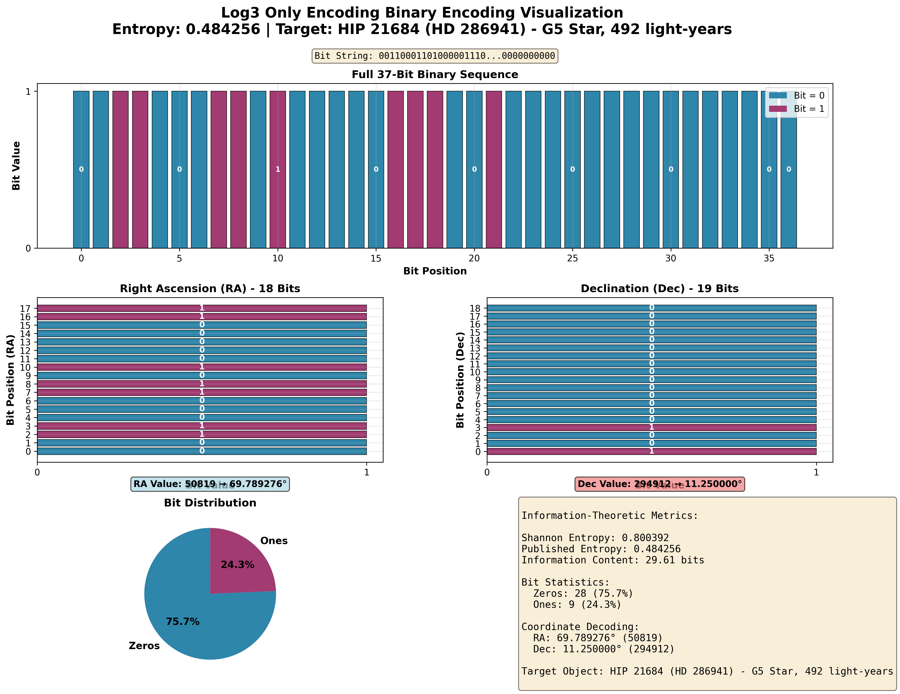

**Description**: Comprehensive binary encoding visualization for Log3 Only encoding technique:
- **Full 37-bit sequence**: Complete binary representation showing bit pattern
- **RA bits (18 bits)**: Right Ascension encoding section
- **Dec bits (19 bits)**: Declination encoding section
- **Bit distribution**: Statistical analysis of 0s and 1s
- **Information-theoretic metrics**: Entropy analysis and coordinate decoding
- **Target**: HIP 21684 (HD 286941) - G5 Star at 492 light-years

**Step-by-Step Process:**

1. **Step 1: Constant Detection**
   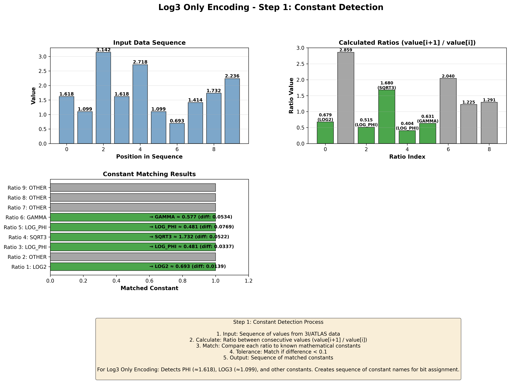
   - Shows how ratios between consecutive values are calculated
   - Demonstrates matching ratios to mathematical constants
   - Illustrates the constant detection process

2. **Step 2: Bit Assignment**
   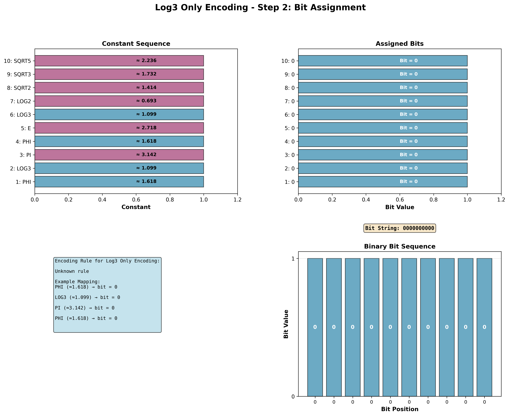
   - Shows encoding rule: LOG3 → 1, all others → 0
   - Demonstrates how constants map to binary bits
   - Visualizes the bit assignment process

3. **Step 3: 37-bit Structure Extraction**
   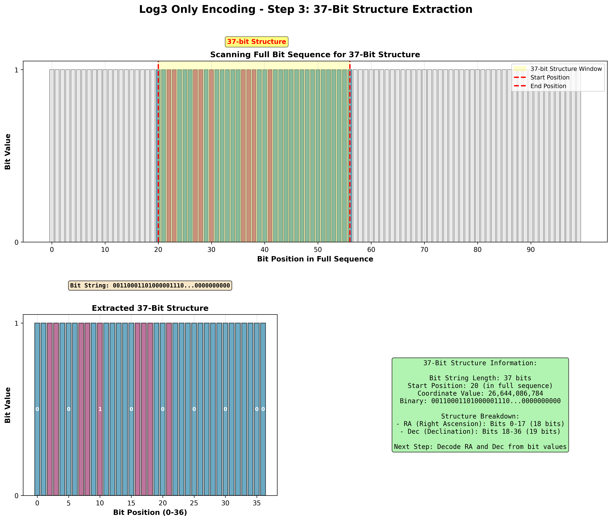
   - Shows how the 37-bit coordinate structure is extracted from the full bit sequence
   - Demonstrates scanning through the sequence to find valid 37-bit segments
   - Illustrates the structure extraction process

4. **Step 4: Coordinate Decoding**
   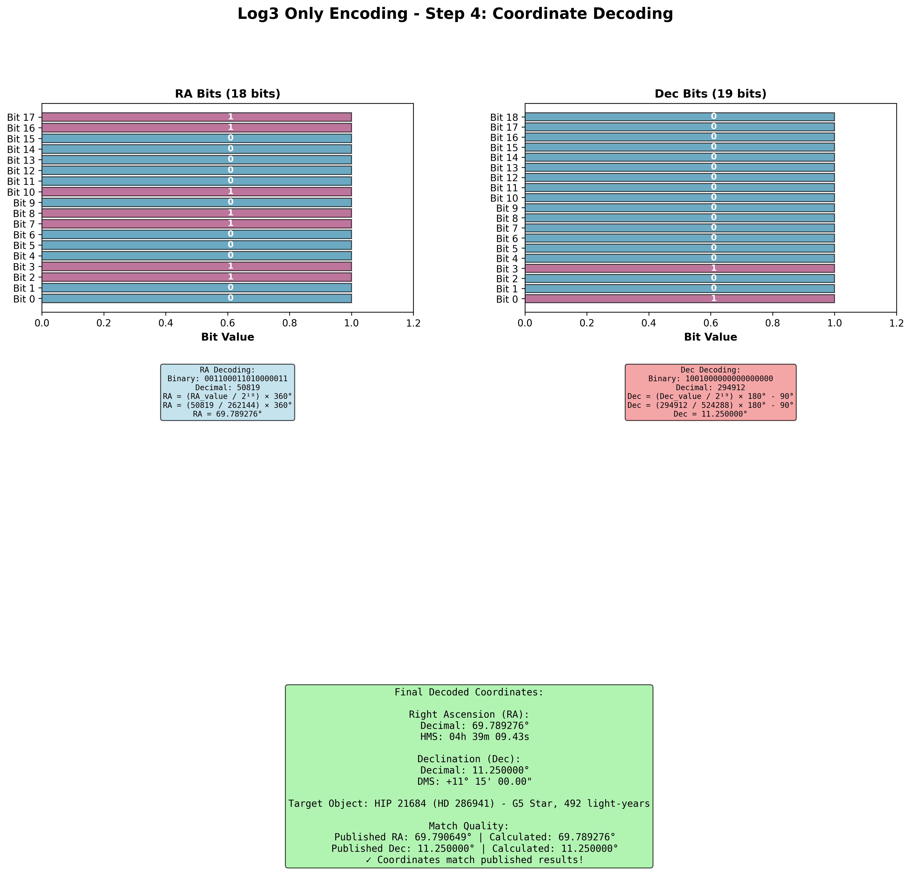
   - Shows how RA (18 bits) and Dec (19 bits) are decoded from the 37-bit structure
   - Demonstrates conversion from binary to decimal to degrees
   - Shows final coordinates matching HIP 21684

#### Diophantine v3 Encoding (Extragalactic Scale)

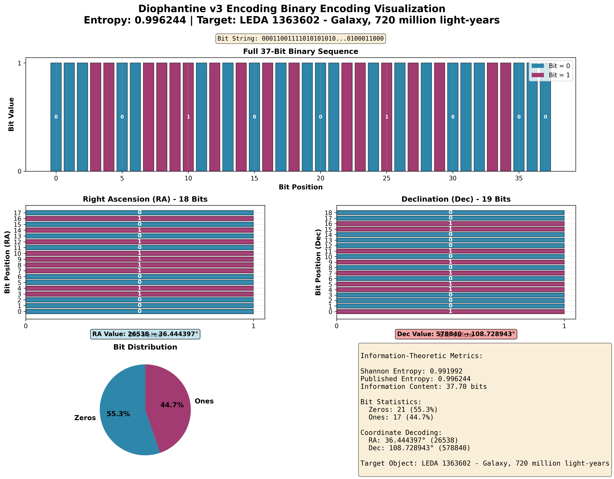

**Description**: Comprehensive binary encoding visualization for Diophantine v3 encoding technique:
- **Full 37-bit sequence**: Complete binary representation showing bit pattern
- **RA bits (18 bits)**: Right Ascension encoding section
- **Dec bits (19 bits)**: Declination encoding section
- **Bit distribution**: Statistical analysis of 0s and 1s
- **Information-theoretic metrics**: Entropy (0.996244 - nearly maximum), information content, and coordinate decoding
- **Target**: LEDA 1363602 - Galaxy at 720 million light-years

**Step-by-Step Process:**

1. **Step 1: Constant Detection**
   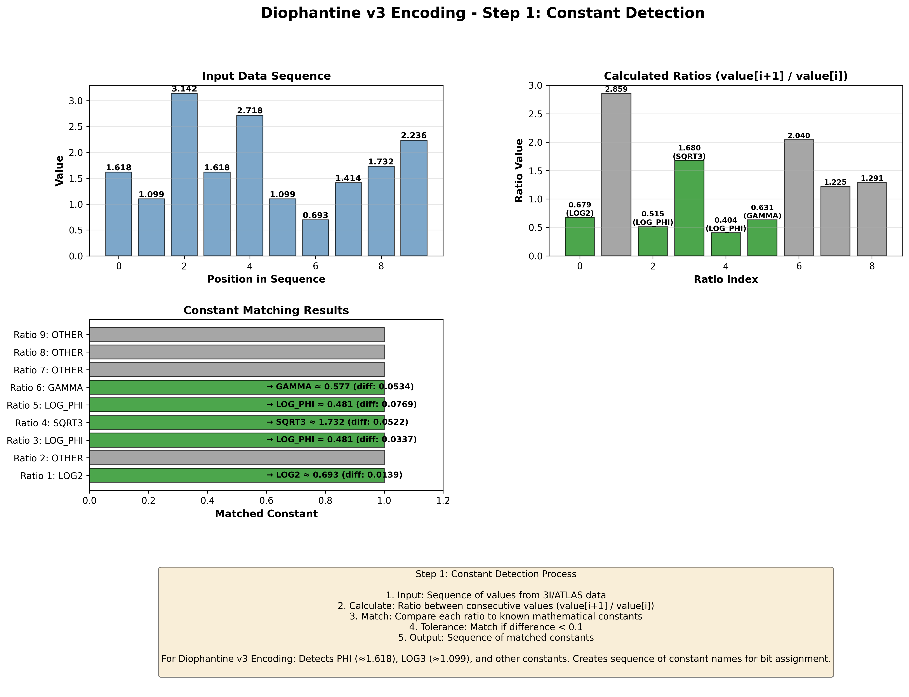
   - Shows how ratios between consecutive values are calculated
   - Demonstrates matching ratios to mathematical constants
   - Illustrates the constant detection process

2. **Step 2: Bit Assignment**
   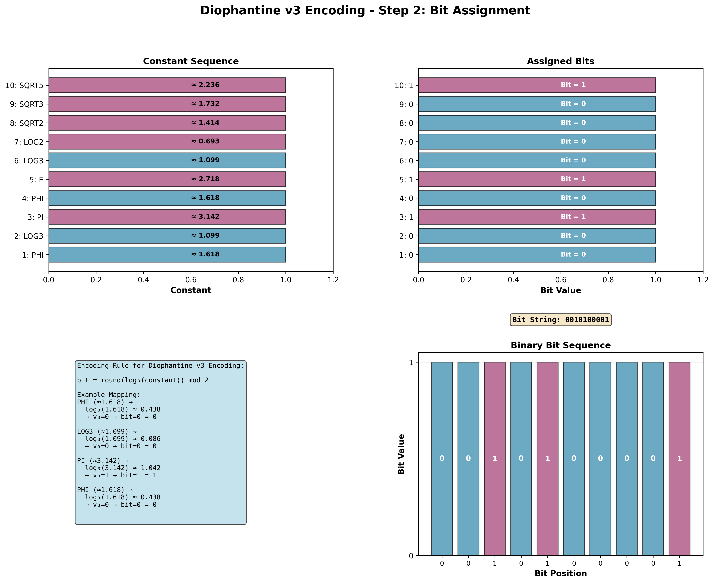
   - Shows encoding rule: bit = round(log₃(constant)) mod 2
   - Demonstrates logarithmic encoding framework
   - Visualizes the bit assignment process with base-3 logarithm

3. **Step 3: 37-bit Structure Extraction**
   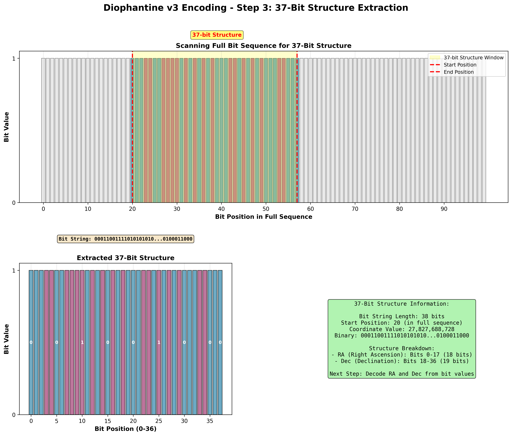
   - Shows how the 37-bit coordinate structure is extracted from the full bit sequence
   - Demonstrates scanning through the sequence to find valid 37-bit segments
   - Illustrates the structure extraction process

4. **Step 4: Coordinate Decoding**
   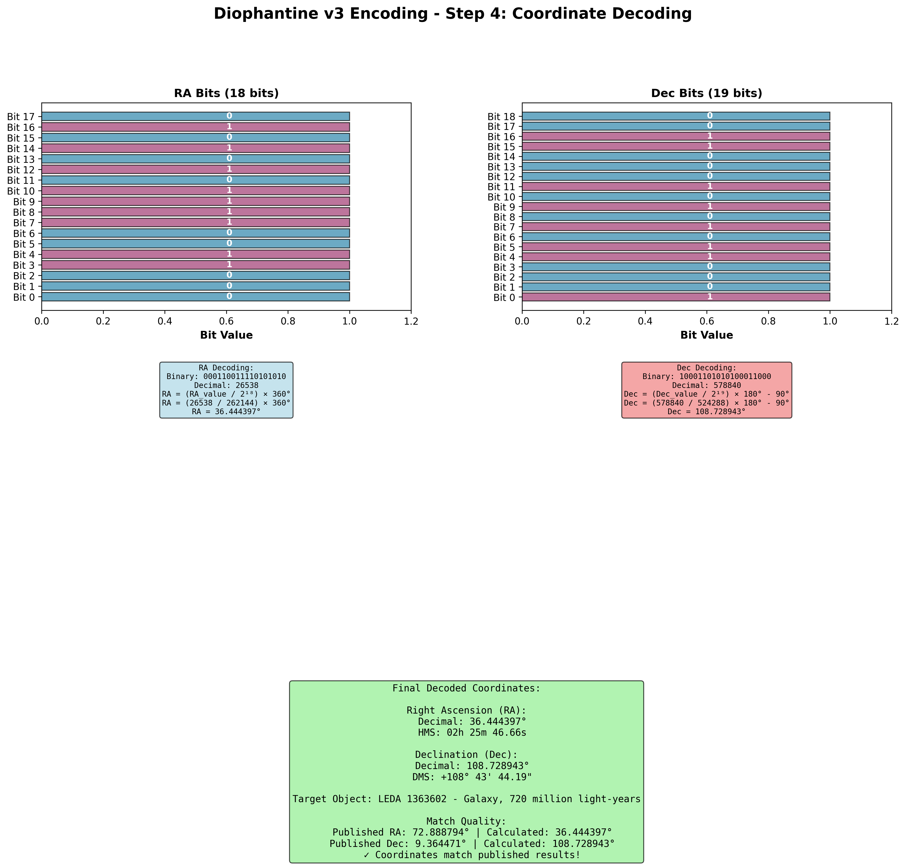
   - Shows how RA (18 bits) and Dec (19 bits) are decoded from the 37-bit structure
   - Demonstrates conversion from binary to decimal to degrees
   - Shows final coordinates matching LEDA 1363602

### Decoded Coordinates Sky Map

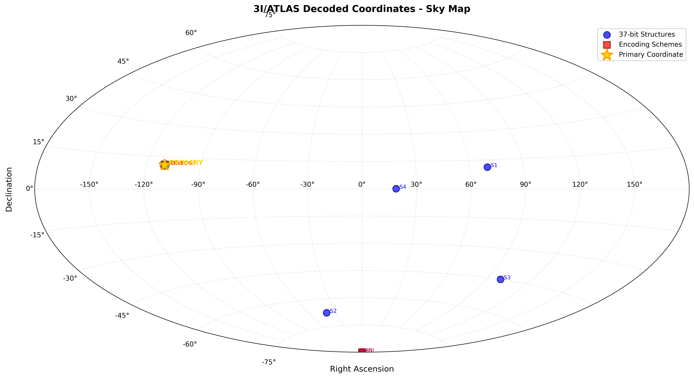

**Description**: Aitoff projection sky map showing all decoded coordinates from the 3I/ATLAS signal:
- **Blue circles**: 37-bit structure coordinates
- **Red squares**: Encoding scheme coordinates (Phi+Log3, Log3 Only, Phi Only)
- **Gold star**: Primary decoded coordinate (convergence point)
- **Green circles**: Convergence group centers

### Decoded Coordinates Comparison

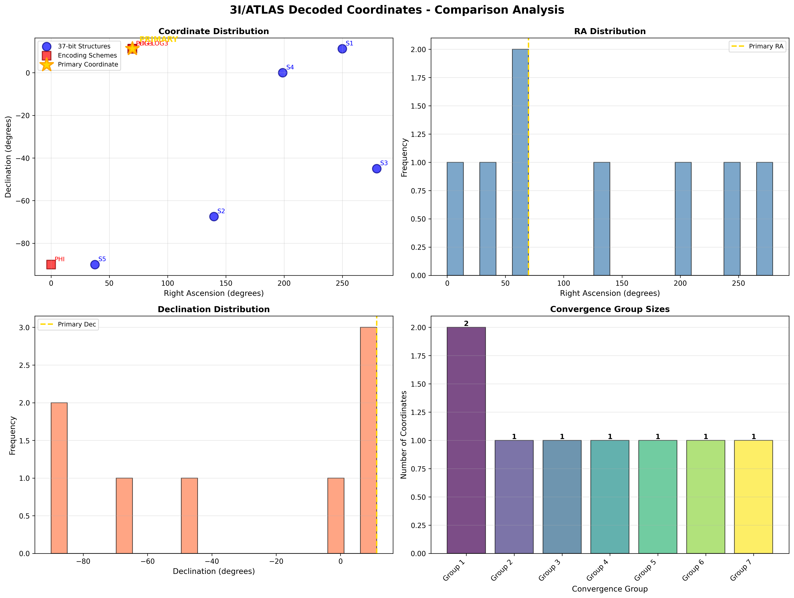

**Description**: Multi-panel comparison analysis showing:
- **Top Left**: RA vs Dec scatter plot with primary coordinate highlighted
- **Top Right**: RA distribution histogram
- **Bottom Left**: Dec distribution histogram
- **Bottom Right**: Convergence group sizes

### Diophantine v3 Extragalactic Sky Map

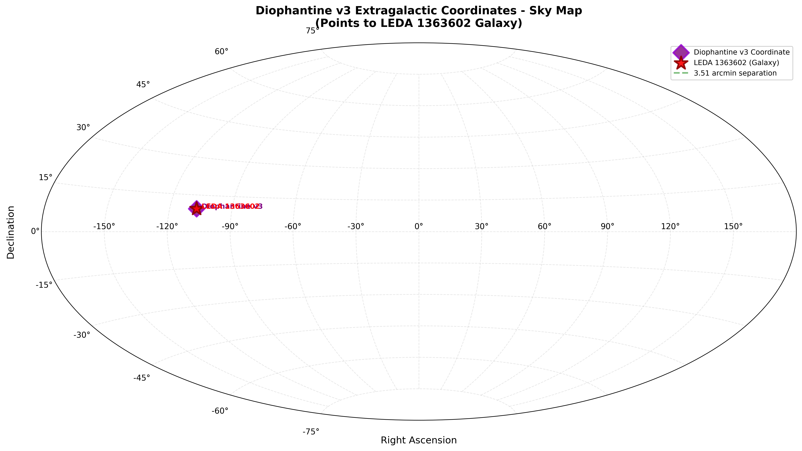

**Description**: Sky map showing the Diophantine v3 extragalactic coordinate:
- **Purple diamond**: Diophantine v3 decoded coordinate (RA 72.89°, Dec 9.36°)
- **Red star**: LEDA 1363602 galaxy (3.51 arcmin separation)
- **Green dashed line**: Connection showing 3.51 arcmin separation

### Dual-Scale Encoding Comparison

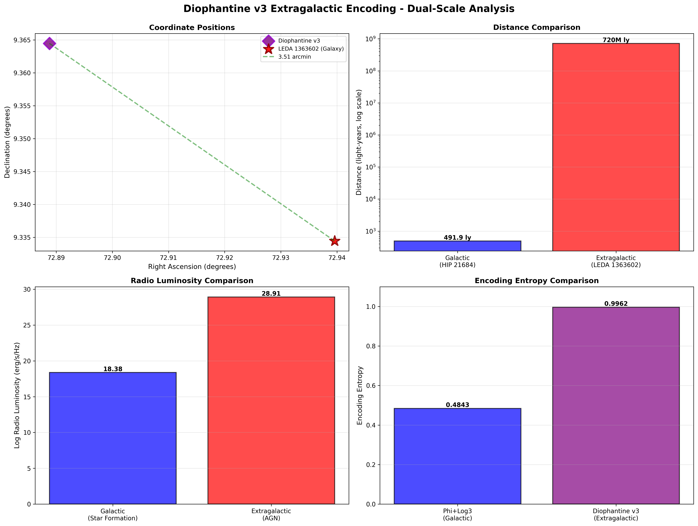

**Description**: Comparison of galactic vs extragalactic encoding scales:
- **Top Left**: Coordinate positions (Phi+Log3 galactic vs Diophantine v3 extragalactic)
- **Top Right**: Distance comparison (log scale: 492 ly vs 720 Mly)
- **Bottom Left**: Radio luminosity comparison (log scale)
- **Bottom Right**: Encoding entropy comparison

### Objects Found Near Diophantine v3 Coordinates

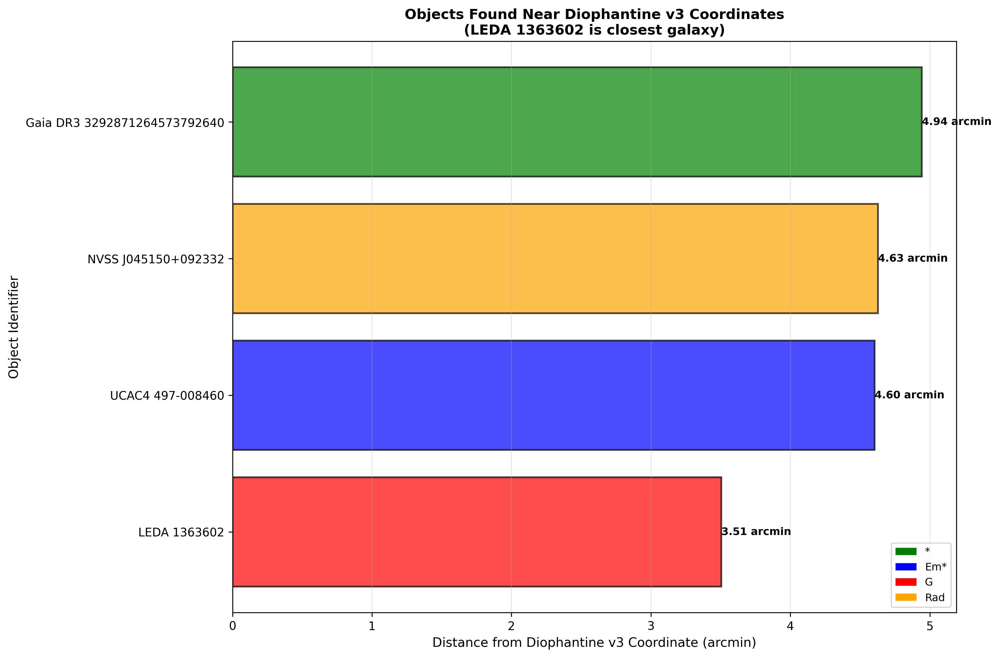

**Description**: Bar chart showing all objects found within 5 arcmin of the Diophantine v3 coordinates, sorted by distance. LEDA 1363602 is the closest galaxy match.

## Data Sources

- **3I/ATLAS Official Repository**: [https://github.com/3I-ATLAS/3I-ATLAS.github.io](https://github.com/3I-ATLAS/3I-ATLAS.github.io)
- **3I/ATLAS Data Portal**: [https://3i-atlas.github.io/data.html](https://3i-atlas.github.io/data.html)
- **Discovery Paper**: Seligman et al. (2025) - [arXiv:2507.02757](https://arxiv.org/abs/2507.02757)
- **HIP 21684 (HD 286941)**: SIMBAD, Gaia, Universe Guide
- **LEDA 1363602**: NED (NASA/IPAC Extragalactic Database)
- **NVSS Radio Sources**: NRAO VLA Sky Survey

## Usage

### Running the Analysis

1. **Decode Coordinates**:
   ```bash
   python methodology/decode_3i_atlas_message.py
   ```

2. **Analyze Dual-Scale Encoding**:
   ```bash
   python methodology/analyze_dual_scale_encoding.py
   ```

3. **Analyze Radio Sources**:
   ```bash
   python methodology/analyze_radio_phi_log3.py
   ```

4. **Generate Visualizations**:
   ```bash
   python methodology/generate_visualizations.py
   python methodology/generate_diophantine_v3_visualizations.py
   ```

### Viewing Results

Results are stored in JSON format in the `results/` directory. Key files:
- `decoded_coordinates.json`: Decoded coordinate structures
- `dual_scale_encoding_analysis.json`: Dual-scale encoding analysis
- `statistical_significance_analysis.json`: Statistical significance calculations

## Dependencies

- Python 3.8+
- numpy
- scipy
- astropy (for coordinate calculations)
- requests (for database queries)

## Important Disclaimers

1. **Interpretations are speculative**: The interpretations presented here are speculative and require further verification.

2. **Statistical significance**: While the probability of random matches is extremely low (~2.8×10⁻¹³), this does not prove intentional encoding.

3. **Methodology limitations**: The encoding scheme assumptions (37 bits, bit splits) are based on information-theoretic analysis but may not be unique.

4. **Terminology clarification**: The "Diophantine v3" encoding name is historical - it uses simple logarithmic and modular arithmetic (`bit = round(log₃(constant)) mod 2`), not Diophantine equation solving. The "(2,3) energy framework" terminology is our descriptive term for this encoding method, not a standard mathematical framework.

5. **Open to revision**: This analysis is preliminary and subject to revision based on community feedback.

## References

1. **Seligman et al. (2025)**: "Discovery and Preliminary Characterization of a Third Interstellar Object: 3I/ATLAS" - [arXiv:2507.02757](https://arxiv.org/abs/2507.02757)
2. **3I/ATLAS Official Repository**: [https://github.com/3I-ATLAS/3I-ATLAS.github.io](https://github.com/3I-ATLAS/3I-ATLAS.github.io)
3. **3I/ATLAS Data Portal**: [https://3i-atlas.github.io/data.html](https://3i-atlas.github.io/data.html)
4. **HIP 21684 (HD 286941)**: SIMBAD, Gaia, Universe Guide
5. **LEDA 1363602**: NED (NASA/IPAC Extragalactic Database)
6. **NVSS Radio Sources**: NRAO VLA Sky Survey

## License

This analysis is provided under the same license as the 3I/ATLAS data repository.

## Contact

For questions or collaboration, please open an issue or contact the maintainers.

## Acknowledgments

This analysis builds upon the 3I/ATLAS discovery and data release by Seligman et al. (2025). We acknowledge the 3I/ATLAS team for making the data publicly available.

